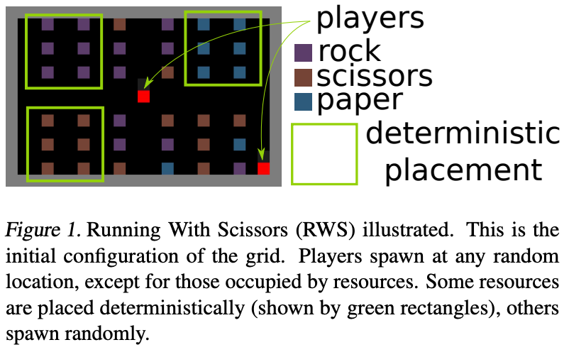
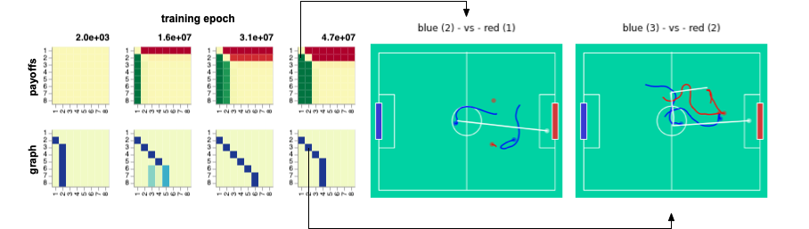
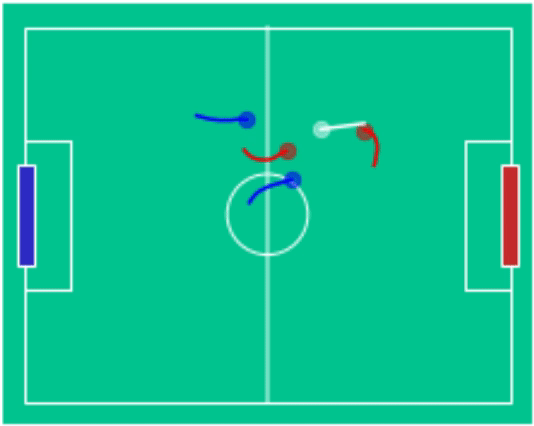

# Summary
Game-theoretic population learning enables strategic exploration in games with convergence guarantees to solution concepts such as Nash Equilibrium (NE). However, applying such method to real-world games that require approximate best-response solvers (such as deep RL) does not scale, due to the difficulty in iteratively training best-response agent.

We propose Neural Population Learning (NeuPL), a general and efficient population learning framework that learns and represents diverse policies in symmetric zero-sum games within a single conditional network via "self-play".

# Demo

## Running-with-Scissors

In this section we visualize gameplays between 8 distinct policies, represented and executed by a single conditional network in a game of `running-with-scissors`[^1].



To do well in this case, players must learn to infer opponent behaviours based on its limited field-of-view (a 4x4 square in front of the player). For example, if `rock`s are missing from its usual location, then the opponent must have picked up `rock`s!

### Training Progression through Time

We show the training progression of a neural population of policies through time, starting from a fixed intial policy that always pick up all the `rock`s. Starting from the initial policy, we show that a single conditional network $$\Pi_\theta(\cdot \mid o_{<}, \sigma)$$ discovered and represented a set of 8 distinct policies, each best-responding to combinations of others. 

<p align="center">
  
</p>

### Visualisation of Learned Policies

If you click on a cell in the payoff matrix, an example episode between the pair of policies would be shown. You can step through the episode and observe how the two players' inventories change over time as well as their respective, partial view of the environment.  

<p align="center">
<div id="selector-view"></div>
<iframe id="episode-view" src="assets/data/episode_1_0_00.html" scrolling=no height='840' width='600' frameborder='0'></iframe>
<script type="text/javascript">
    var spec = getSpec();
    var view = new vega.View(vega.parse(spec), {
      renderer:  'canvas',
      container: '#selector-view',
      hover:     true
    }).run();

    const episode_view = document.getElementById("episode-view");
    view.addEventListener('click', function(event, item) {
      if (item != null) {
        console.log('clicked', item.datum.home_id, item.datum.away_id);
        episode_view.src = "assets/data/episode_" + item.datum.home_id + "_" + item.datum.away_id + "_00.html";
      }
    });
</script>
</p>

## 2-vs-2 MuJoCo Football

<p align="center">
  
</p>

We investigate NeuPL in the physically simulated multi-agent environment of 2-vs-2 [MuJoCo Football](https://github.com/deepmind/dm_control/blob/master/dm_control/locomotion/soccer/README.md)[^2], using the 3 DoF BoxHead walkers.

### Training Progression through Time



Through time, a sequence of best-responses emerged with policy $$\Pi_\theta(\cdot \mid o_{<}, \sigma_2)$$ mastering rapid long-range shots and $$\Pi_\theta(\cdot \mid o_{<}, \sigma_3)$$ developing coordinated team play. Checkout the game-play on the right hand side (`blue (3) - vs red (2)`) in action! 

<p align="center" width=400 height=300>
  
</p>

### Example Games

We note that beyond policy (3), it becomes difficult to tell different policies apart as they all are highly skilled and perform coordinated team-play. This is not surprising. MuJoCo Football is a fully-observed environemnt that affords prominent transitive skill dimensions but comparatively muted strategic cyles. In this case, NeuPL automatically reduces to a learning regime similar to that of self-play, which is optimal in purely transitive games[^3].


| Match-Up                |      Visuals|
|-------------------------|:-------------:|
| `blue (2) - vs red (1)` |  |
| `blue (3) - vs red (2)` |  |
| `blue (4) - vs red (3)` |  |
| `blue (5) - vs red (4)` |  |


# Citation

```bibtex
@inproceedings{
liu2022neupl,
title={Neu{PL}: Neural Population Learning},
author={Siqi Liu and Luke Marris and Daniel Hennes and Josh Merel and Nicolas Heess and Thore Graepel},
booktitle={International Conference on Learning Representations},
year={2022},
url={https://openreview.net/forum?id=MIX3fJkl_1}
}
```

--------

References:

[^1]: Vezhnevets, A., Wu, Y., Eckstein, M., Leblond, R. &amp; Leibo, J.Z.. (2020). OPtions as REsponses: Grounding behavioural hierarchies in multi-agent reinforcement learning. <i>Proceedings of the 37th International Conference on Machine Learning</i>, in <i>Proceedings of Machine Learning Research</i> 119:9733-9742 Available from https://proceedings.mlr.press/v119/vezhnevets20a.html.

[^2]: Liu, S., Lever, G., Merel, J., Tunyasuvunakool, S., Heess, N., & Graepel, T. (2018, September). Emergent Coordination Through Competition. In International Conference on Learning Representations. 

[^3]: Balduzzi, D., Garnelo, M., Bachrach, Y., Czarnecki, W., Perolat, J., Jaderberg, M., & Graepel, T. (2019, May). Open-ended learning in symmetric zero-sum games. In International Conference on Machine Learning (pp. 434-443). PMLR.
